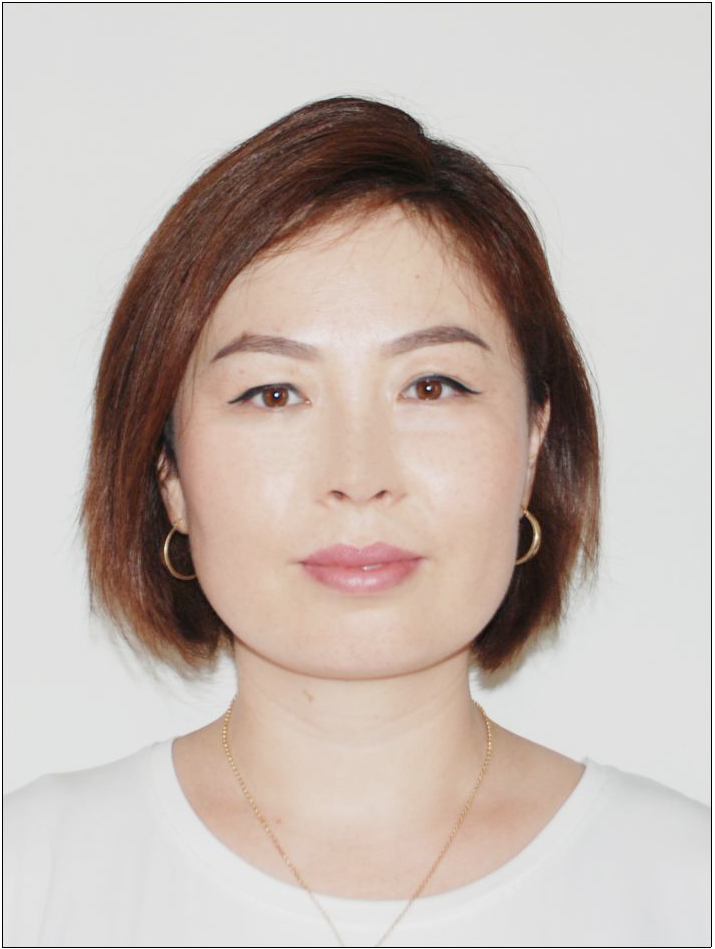

# **Katkeldieva Gulzana**  
## *Junior Frontend (React) Developer*
###
> Programmer who commit his dedication and full 
> effort for any assigned tasks and who is confident
> would be a valuable asset to the team. Besides has an experience working with customers in the
> banking system as well as working in the government agency in his belt. Diversified, reliable and
> communicative person with a big desire to the further development.
# Reach me at:
* Mobile: (996) 707 411 680
* E-mail: gulzana.katkeldieva@gmail.com
* Telegram: @Gulzana_M
* [Linkedin](linkedin.com/in/gulzanakatkeldieva)
* Address: Bishkek, Kyrgyzstan
*****   *****   *****   *****
# Hard Skills:
+ **HTML/CSS(SASS/SCSS)**
+  **JavaScript, TypeScript**
+  **React.js, Redux(Thunk/Toolkit) Next.js**
+  **Experience With Rest API, Axios**
+  **Experience With Git and Github**
+  **Flex, Grid, Bootstrap, Material Ui, Blitz.js**
+  **BEM, Responsive web Design**
+  **Jira, Trello**
-----   ------    -------    ------
# Soft Skills:
- Teamplayer
- Self-management
- Cooperate and work with team
- Meet deadlines and keep superiors informed
- Learn and Improve
- Active Listening skills
- Project Management
- Interpersonal Relationship
*****    *** ** ** 
# Career Summary:
## *Internship at Zetta Soft company*
### **Project Experience | Sept 2021 - Feb 2022**
*Educational platform* - [https://aiplus.kz/ru/almaty](https://aiplus.kz/ru/almaty)
Tasks: adaptive layout;
*Online store* - [https://kebek.kz/](https://kebek.kz/) Tasks: adaptive layout;
*Online flower shop* -[flower-shop-e3j0yh1ji-kgulzana.vercel.app](flower-shop-e3j0yh1ji-kgulzana.vercel.app). Tasks: adaptive layout, implementation
of CRUD Operations using React, React Hooks, Redux
Toolkit and Axios.
USED:
React.js, TypeScript, Next.js, Redux Toolkit, HTML5, CSS3, Sass/Scss, React-Bootstrap, Material Ui, Swiper.js, Formik;
* * * * * * * * * * 
# Academic Education
* IT ACADEMY (BOOTCAMP)
        
        Frontend developer, Sept 2020 - July 2021
* KYRGYZ NATIONAL UNIVERSITY
    
        International Relations, 2003 - 2008
* KYRGYZ RUSSIAN SLAVIC UNIVERSITY
        
        Faculty of Economics, 2009 - 2012
---------
# Languages
* ***English*** - *Upper - intermediate*
* ***Russian*** - *Proficient*
* ***French*** - *Intermediate*
* ***Kyrgyz*** - *Native*

